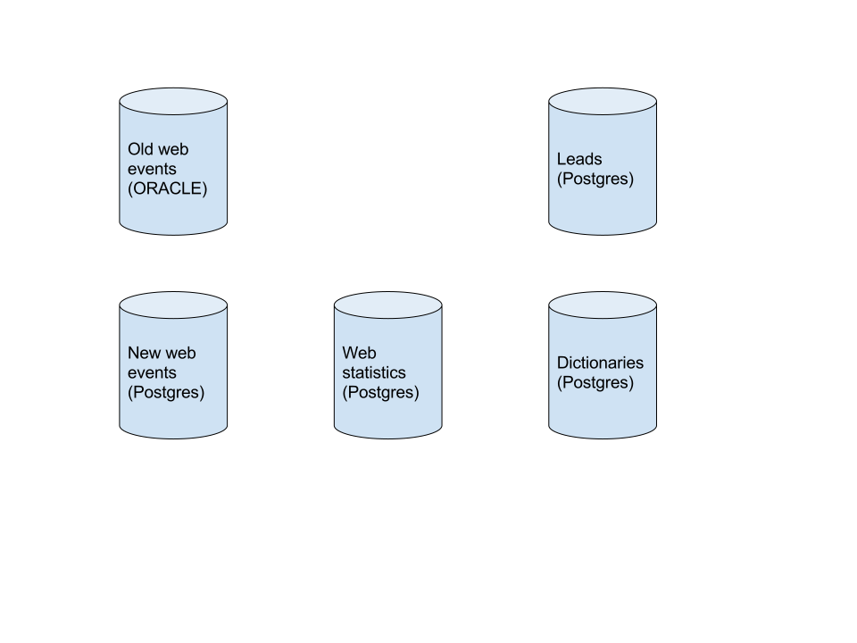
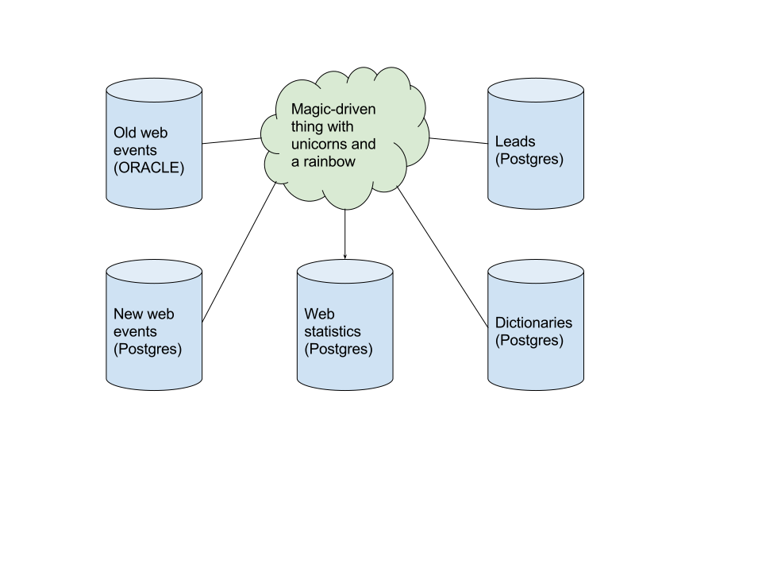
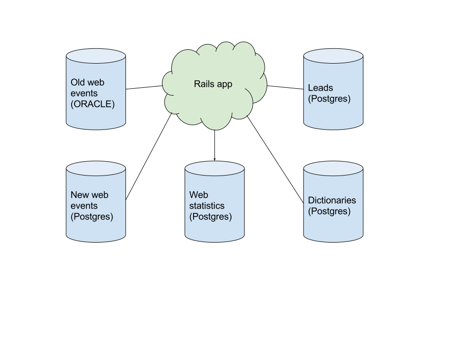
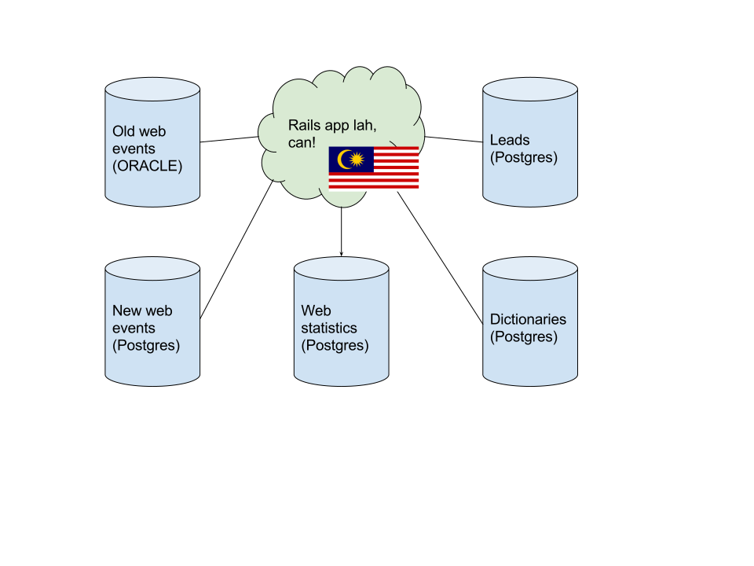

# Multiple Backend DBs In A Rails Application

author
: Anton Lvov

institution
: Rapid River Software

theme
: rabbit

# whoami
{:relative_width="15"}

* Weird sounding russian guy
* Armchair guitar player
* Son, husband, father
* Yack shaver at Rapid River Software

# Stay cool  
{:relative_height="80"}

# The challenge
{:relative_height="80"}

# The challenge
{:relative_height="80"}

# Hard decisions
{:relative_height="80"}

# Let's try rails!
{:relative_height="80"}

# Let's try rails!
{:relative_height="80"}

# Let's try rails in Malaysia!
{:relative_height="80"}

# Rails app with a single DB
```
/single_db_app
|
|_/app
| |_/models
...
|_/config
| |_database.yml
...
|
|_/db
| |_/migrate
| |_seed.rb
| |_schema.rb
|
...
```

# Rails app with multiple DBs
{:relative_height="80"}

# Hey, Mr. Meeseeks!
{:relative_height="80"}

# Hey, Mr. Meeseks!
{:relative_height="80"}

# Manage DB connections
* Each DB connection information should be stored in a dedicated `config/database/db_name.yml` file
    
```
/
|_/config
| |_/database
|   |_db_1.yml
|   |_db_2.yml
|  ...
|   |_db_n.yml
|
...
```

# Initialize DB configs
* We should read all DB configs at the application initialization step

```
/config/initializers/databases.rb:

ALL_ENV_DB_CONFIGS = [:db1, :db2, ...].each_with_object(HashWithIndifferentAccess.new) do |db, dbs|
  f = File.read(Rails.root.join('config', 'database', "#{db}.yml"))
  config = YAML.load(ERB.new(f).result)
  dbs[db] = HashWithIndifferentAccess.new(config)
end

DB_CONFIGS = ALL_ENV_DB_CONFIGS.keys.each_with_object(HashWithIndifferentAccess.new) do |db, dbs|
  raise("No configuration for #{db} in #{Rails.env} environment!") unless ALL_ENV_DB_CONFIGS[db][Rails.env]
  dbs[db] = ALL_ENV_DB_CONFIGS[db][Rails.env]
end
```

# Default rails app DB
* We should choose a default database for our Rails application

```
/config/application.rb:

...
OurApp::Db.select_current_database('db1')
...

/lib/ourapp/db.rb:

module OurApp
  module Db
    def self.select_current_database(name)
      @database ||= :db1
      point_to(name)
    end

    private_class_method def self.point_to(name)
      root = "db/#{name}"
      Rails.application.config.paths['db']               = root
      Rails.application.config.paths['db/migrate']       = "#{root}/migrate"
      Rails.application.config.paths['db/seeds.rb']      = "#{root}/seeds.rb"
      Rails.application.config.paths['config/database']  = "config/database/#{name}.yml"
      ActiveRecord::Migrator.migrations_paths            = ["#{root}/migrate"]
      ENV['SCHEMA'] = "#{root}/schema.rb"
      ENV['DB_STRUCTURE'] = "#{root}/structure.sql"
    end
  end
end
```

# Organize DB files
* Each DB should has its own folder in `/db`

```
/
|_/db
| |_/db1
| | |_/code
| | | |_/functions
| | | |_/views
| | |_/seeds
| | |_/migrate
| | |_seeds.rb
| | |_structure.sql
| |
| |_/db2
...
```

# Organize models
* Models are organized in a separate folders for each DB

```
/app
|_/models
| |_/foo_db
| | |_base.rb
| |
| |_/bar_db
|   |_base.rb
```

# Create base models
* Each DB has its own abstract base model

```
module FooDb 
  class Base < ActiveRecord::Base
    establish_connection DB_CONFIGS[:foo_db]
    self.abstract_class = true
  end
end
```

# Create migration generators
* Each DB has its own migration generator

```
require 'rails/generators/active_record/migration/migration_generator'

class FooDbMigrationGenerator < ActiveRecord::Generators::MigrationGenerator
  def create_migration_file
    set_local_assigns!
    validate_file_name!
    migration_template @migration_template, "db/foo_db/migrate/#{file_name}.rb"
  end
end

Usage:

rails generate foo_db_migration AddBarToFoo
```

# Create a set of rake tasks...

* Each DB should have its own set of rake tasks

```
namespace :foo_db do |ns|
  [:drop, :create, :migrate, :reset, :rollback, :seed, :setup, :version].each do |tsk|
    desc "MH database: #{tsk}"
    task tsk do
      OurApp::Db.select_current_database(:foo_db) 
      Rake::Task["db:#{tsk}"].invoke
    end
  end
end
```

# ...and use them!

```
rake ourapp:db:foo_db:migrate
rake ourapp:db:foo_db:reset
rake ourapp:db:foo_db:seed
...
```

# Out of scope

* DB specific things (customized rake tasks for each DB)
* `rake` tasks for a table partitioning
* PG `\copy` bulk loader implementation
* DB code versioning concepts

# Where to find me

* GitHub: denied404
* Twitter: 404_denied

\* _Yes, I know that 404 stands for "Not Found", smarty ;)_
